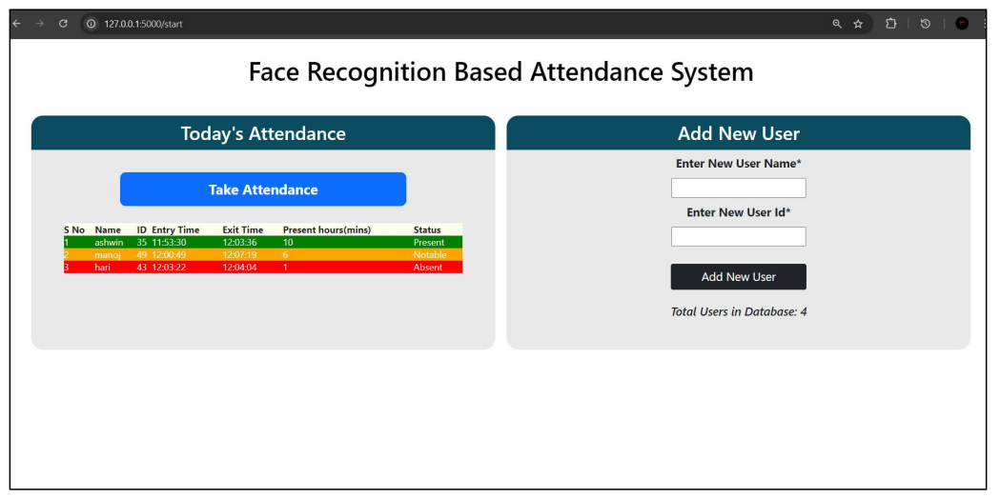

# Face Recognition-Based Attendance System

## Table of Contents  
1. [Description](#description)  
2. [Features](#features)  
3. [Technologies Used](#technologies-used)  
4. [Project Overview](#project-overview)  
5. [Project Structure](#project-structure)  
6. [Installation and Setup](#installation-and-setup)  
7. [Usage](#usage)  
8. [Result](#result)  
9. [References](#references)  
10. [Contributors](#contributors)  

## Description
This project is a real-time, automated attendance system leveraging face recognition technology. It combines Flask, OpenCV, and K-Nearest Neighbors (KNN) to detect and recognize faces, track attendance, and generate detailed reports.

## Features
- **Contactless Attendance**: Utilizes a webcam to capture faces and log attendance.
- **Real-Time Recognition**: Identifies and classifies faces in real-time.
- **Dynamic Status Updates**: Categorizes attendees as "Present," "Notable," or "Absent" based on time spent.
- **User Management**: Provides an interface to add, manage, and display users.
- **Daily Logs**: Stores attendance records in CSV files for easy access.

## Technologies Used
- **Programming Language**: Python
- **Framework**: Flask
- **Libraries**: OpenCV, Pandas, NumPy, scikit-learn
- **Frontend**: HTML, CSS

## Project Overview
This system automates the attendance process, ensuring:
1. Improved accuracy by eliminating manual errors.
2. Reduced administrative workload.
3. Adaptability for various environments such as educational institutions and workplaces.

The application is structured to:
- Detect faces using Haar Cascade Classifier.
- Recognize faces with KNN for reliable identification.
- Generate visual feedback and attendance logs via a user-friendly Flask interface.

## Project Structure

Face-Recognition-Attendance
│── Attendance
│   ├── Attendance-YYYY-MM-DD.csv
│
│── docs
│   ├── Block Diagram.png
│   ├── Flow Diagram.png
│   ├── References.txt
│   ├── System Design.png
│
│── static
│   │── css
│   │   ├── styles.css
│   │
│   │── js
│   │   ├── scripts.js  
│
│── templates
│   ├── home.html
│   ├── results.html
│
│── .gitignore
│── app.py
│── config.py
│── haarcascade_frontalface_default.xml
│── requirements.txt


## Installation and Setup
1. Clone this repository:
    ```bash
    git clone https://github.com/anna123venkat/Face-Recognition-Attendance.git
    ```
2. Navigate to the project directory:
    ```bash
    cd Face-Recognition-Attendance
    ```
3. Install the required dependencies:
    ```bash
    pip install -r requirements.txt
    ```
4. Run the application:
    ```bash
    python app.py
    ```
5. Access the application in your browser at `http://127.0.0.1:5000`.

## Usage
1. **Take Attendance**: Click on "Take Attendance" to begin face detection and recognition.
2. **Add New User**: Enter a new user’s name and ID, and the system will capture their face and train the model.
3. **View Logs**: Attendance logs are automatically stored as CSV files in the `Attendance` directory.

## Result

### Block Diagram


Here’s a **References** section you can add to the README file:  

---

## References  

1. **OpenCV Documentation** – [https://docs.opencv.org/](https://docs.opencv.org/)  
   - Used for face detection and image processing.  

2. **Flask Documentation** – [https://flask.palletsprojects.com/](https://flask.palletsprojects.com/)  
   - Used for building the web application backend.  

3. **Scikit-learn Documentation** – [https://scikit-learn.org/stable/](https://scikit-learn.org/stable/)  
   - Used for K-Nearest Neighbors (KNN) face recognition model.  

4. **Pandas Documentation** – [https://pandas.pydata.org/](https://pandas.pydata.org/)  
   - Used for handling attendance logs and CSV file operations.  

5. **NumPy Documentation** – [https://numpy.org/doc/stable/](https://numpy.org/doc/stable/)  
   - Used for numerical computations in image processing and data handling.  

6. **Haar Cascade Classifier** – OpenCV Face Detection Model  
   - [https://github.com/opencv/opencv/tree/master/data/haarcascades](https://github.com/opencv/opencv/tree/master/data/haarcascades)  
   - Used for real-time face detection in the project.  


## Contributors
- **[Prasanna Venkatesh S](https://github.com/anna123venkat)**
- **[Abhishek S](https://github.com/Abishek9342)**
- **[Manoj S](https://github.com/Jonam-2004)**
